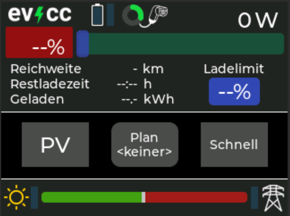

# evcc-CYD 2432S028

Dieses kleine Projekt basiert auf einem 2,8 Zoll Display mit ESP32, das preisgünstig als ESP32-2432S028 (das sogenannte "Cheap Yellow Display") zu bekommen ist, um Infos von der Ladesteuerung für E-Autos [evcc](https://github.com/evcc-io/evcc) in einem kleinen Display in der Garage neben der Wallbox zu haben. Darüber lassen sich auch die Lademodi "PV" und "Schnell" aktivieren, sowie ein fester Plan setzen bzw. löschen. Auch das Einstellen des Ladelimits ist damit möglich.

Somit kann man in der Garage neben der Wallbox sofort sehen, ob aktuell Überschussstrom vorhanden ist und eine Ladung des Autos sinnvoll ist. Eine unter Umständen notwendige Schnellladung, sowie eine geplante Ladung auf einen fest gesetzten SOC zu einer bestimmten Zeit lässt sich über das kleine Display auch starten.

Das Display besitzt WLAN und verbindet sich damit ins heimische LAN, die Werte von evcc werden per MQTT geholt und angezeigt. Änderung von Werten werden per REST API an die evcc Instanz gesendet. Ein Touch-Display, sowie ein SD-Kartenleser sind auch vorhanden. Neben einem Gehäuse benötigt man nur eine 5V Versorgung, z.B. über ein USB-Netzteil.

Ein paar Bilder finden sich in [dieser Diskussion](https://github.com/evcc-io/evcc/discussions/13152).

Das Projekt ist in Visual Studio Code geschrieben mit PlatformIO IDE (v3.3.3). Das GUI ist mit SquareLine Studio v1.4.0 gestaltet, dieses unterstützt aktuell nur die LVGL Bibliothek v8.3.11 sowie die TFT_eSPI Bibliothek. Nach langem Ausprobieren habe ich hier im Projekt passende Werte für die Dateien `lv.conf.h` und `User_Setup.h` hinterlegt.

Um das Projekt kompiliert zu bekommen, muss die Datei `config.h.template` in `config.h` umbenannt und darin die passenden Einstellungen gesetzt werden!

Da evcc nicht alle MQTT Topics häufig veröffentlicht, kann es dauern, bis alle Werte komplett auf dem Display dargestellt werden. Abhilfe: evcc sendet die MQTT Topics mit dem Flag `retain`, d.h. der MQTT Broker sollte so konfiguriert sein, dass er die Topics zwischenspeichert, dann werden die Werte des Displays nach einem Reboot auch schnell wieder befüllt. 

## ToDo:
- Setzen eines Ladeplans (aktuell wird Plan nur gelöscht)
- Hinterlegung von User-spezifischen Werten in eine Datei auf SD-Karte